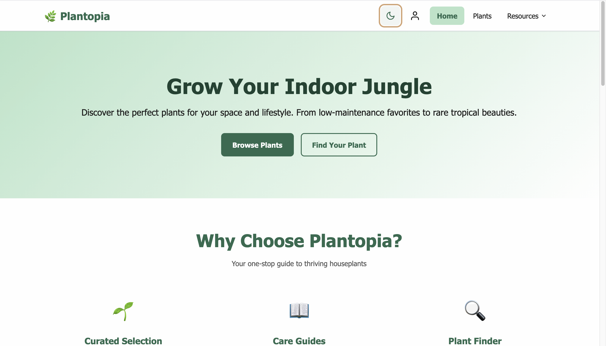
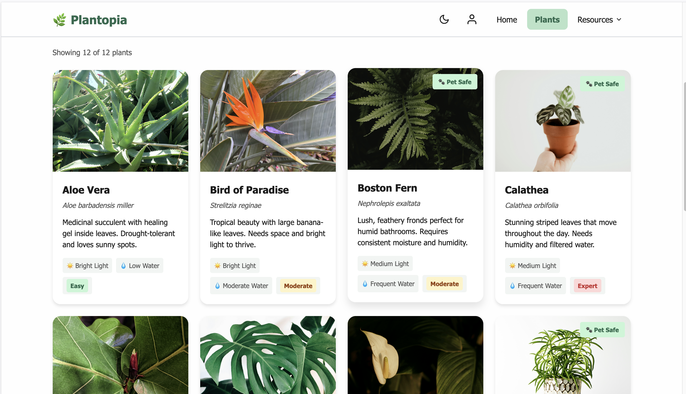
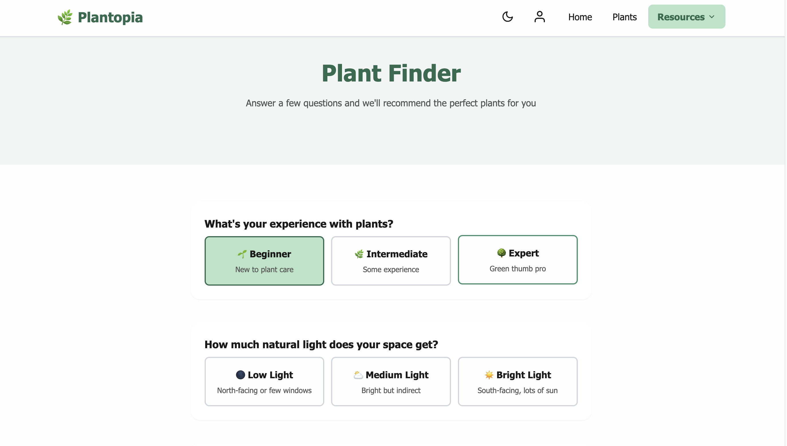
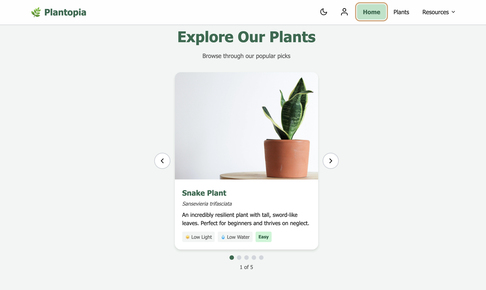
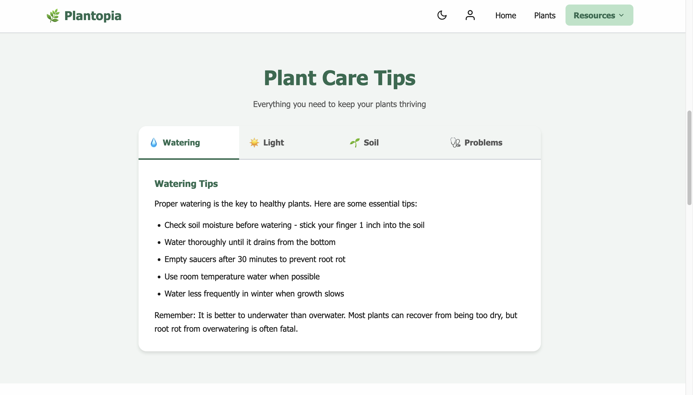

# 🌿 Plantopia - Plant Care Guide

A modern, interactive web application to help users discover and care for houseplants. Built with React and Vite.

[](https://github.com/kneha07/plantopia)

---

## ✨ Features

- 🎨 **Theme Switching** - Toggle between light and dark modes with persistent preferences
- 🌿 **Plant Gallery** - Browse 12+ houseplants with detailed care information
- 🔍 **Advanced Filtering** - Filter plants by light requirements, water needs, difficulty level, and pet safety
- 🎠 **Interactive Carousel** - Featured plants showcase on the homepage
- 🎯 **Plant Finder** - Personalized plant recommendations based on user preferences
- 📑 **Tabbed Content** - Organized plant care guides with tabs for watering, light, soil, and troubleshooting
- ⚙️ **User Settings** - Customizable display name and experience level with modal interface
- 📱 **Fully Responsive** - Optimized for mobile, tablet, and desktop devices
- ♿ **Accessibility Focused** - WCAG AA compliant with keyboard navigation and screen reader support

---

## 🛠️ Technologies Used


- **React** - UI component library with hooks
- **Vite** - Build tool and development server
- **CSS3** - Custom styling with CSS variables
- **JavaScript (ES6+)** - Modern JavaScript features

---

## 📦 Installation

### Prerequisites
- Node.js (v16 or higher)
- npm or yarn

### Setup

1. **Clone the repository**
```bash
git clone https://github.com/kneha07/plantopia.git
cd plantopia
```

2. **Install dependencies**
```bash
npm install
```

3. **Start development server**
```bash
npm run dev
```

4. **Open in browser**
```
http://localhost:5173
```

---

## 🚀 Build for Production
```bash
# Create optimized production build
npm run build

# Preview production build locally
npm run preview

# Or serve the built files
npx serve -s dist
```

---

## 📁 Project Structure
```
plantopia/
├── public/
│   └── images/              # Plant images and icons
├── src/
│   ├── components/
│   │   ├── Header/          # Main header with navigation
│   │   ├── Footer/          # Site footer
│   │   ├── Navigation/      # Dropdown navigation menu
│   │   ├── SkipLink/        # Accessibility skip link
│   │   ├── ThemeToggle/     # Light/dark theme switcher
│   │   ├── PlantCard/       # Reusable plant card component
│   │   ├── Carousel/        # Featured plants carousel
│   │   ├── FilterControls/  # Plant filtering interface
│   │   ├── Tabs/            # Tabbed content component
│   │   ├── Accordion/       # Accordion component
│   │   └── Modal/           # Settings modal dialog
│   ├── pages/
│   │   ├── Home/            # Landing page
│   │   ├── Plants/          # Plant gallery with filters
│   │   ├── PlantFinder/     # Plant recommendation tool
│   │   └── About/           # About page with care tips
│   ├── data/
│   │   └── plants.js        # Plant database
│   ├── App.jsx              # Root component
│   ├── App.css              # Global styles
│   ├── main.jsx             # React entry point
│   └── index.css            # CSS reset & variables
├── .gitignore
├── index.html
├── licenses.txt             # Image attribution
├── package.json
├── README.md
└── vite.config.js
```

---

## 🎨 Key Features Implemented

### Theme Toggle
Users can switch between light and dark themes with a single click. Theme preference is maintained across all pages for a consistent experience.

### Filterable Plant Gallery
Advanced filtering system allowing users to find the perfect plants based on:
- **Light requirements**: Low, Medium, Bright
- **Water needs**: Low, Moderate, Frequent
- **Difficulty level**: Easy, Moderate, Expert
- **Pet safety**: Filter for pet-friendly plants

### Plant Finder Tool
Interactive multi-step questionnaire providing personalized plant recommendations based on:
- User experience level (Beginner, Intermediate, Expert)
- Available natural light in their space
- Watering frequency preference
- Pet ownership status

### User Personalization
Settings modal allowing users to customize:
- Display name (appears in personalized greeting throughout the app)
- Experience level (influences plant recommendations)

---

## 📸 Screenshots

### Light Mode Homepage

*Homepage featuring the hero section with theme toggle, navigation, and call-to-action buttons in light mode*

### Dark Mode Homepage

*The same homepage showcasing the dark theme with improved contrast and eye-friendly colors*

### Plant Gallery with Filters

*Browse all 12 plants with advanced filtering options - filter by light requirements, water needs, difficulty level, and pet safety*

### Plant Finder Tool

*Interactive questionnaire that recommends the perfect plants based on your experience level, available light, watering preference, and pet ownership*

### Featured Plants Carousel

*Rotating showcase of featured plants on the homepage with navigation controls and plant details*

### Plant Care Tips

*Comprehensive care guides organized in tabbed sections covering watering, light requirements, soil needs, and troubleshooting common problems*

---

## 🌱 Plant Database

The application includes detailed care information for 12+ houseplants:

- **Snake Plant** (Sansevieria trifasciata)
- **Pothos** (Epipremnum aureum)
- **Spider Plant** (Chlorophytum comosum)
- **Monstera** (Monstera deliciosa)
- **Fiddle Leaf Fig** (Ficus lyrata)
- **Aloe Vera** (Aloe barbadensis miller)
- **Boston Fern** (Nephrolepis exaltata)
- **Rubber Plant** (Ficus elastica)
- **Calathea** (Calathea orbifolia)
- **Peace Lily** (Spathiphyllum)
- **ZZ Plant** (Zamioculcas zamiifolia)
- **Jade Plant** (Crassula ovata)

Each plant profile includes:
- Common and scientific names
- Light requirements
- Water needs
- Difficulty level
- Detailed care instructions
- Pet safety information

---

## ♿ Accessibility

Plantopia is built with accessibility as a core priority:

### WCAG AA Compliance
- ✅ Color contrast ratios meet AA standards (4.5:1 minimum)
- ✅ Font sizes in rem units (minimum 0.75rem)
- ✅ Keyboard navigation for all interactive elements
- ✅ Visible focus indicators on all controls

### Semantic HTML
- Proper use of landmark elements (`<header>`, `<nav>`, `<main>`, `<footer>`)
- Logical heading hierarchy (h1-h6)
- Descriptive button and link text
- Associated labels for all form fields

### ARIA Implementation
- `aria-label` attributes for icon buttons
- `aria-expanded` for dropdown states
- `aria-labelledby` for modal headings
- Proper roles where semantic HTML is insufficient

### Additional Features
- Skip link to main content
- Comprehensive alt text for all images
- No automatic content rotation
- Reduced motion support via `prefers-reduced-motion` media query

---

## 🎯 What I Learned

Building Plantopia deepened my understanding of:

- **React Fundamentals**: Component composition, hooks (useState, useEffect, useRef), and efficient state management
- **Accessibility**: Implementing WCAG AA standards, ARIA attributes, and creating truly inclusive user experiences
- **Responsive Design**: Mobile-first approach with CSS Grid, Flexbox, and adaptive breakpoints
- **User Experience**: Creating intuitive interfaces through user-centered design principles
- **Performance**: Optimizing bundle size and implementing efficient rendering patterns

---

## 💼 Professional Applications

This project demonstrates skills directly applicable to:
- Frontend development roles requiring React expertise
- Full-stack positions with modern JavaScript frameworks
- Quality assurance with accessibility and testing focus
- UI/UX design and implementation

---

## 📄 License

This project is open source and available under the MIT License.

### Image Attribution

Plant images sourced from [Unsplash](https://unsplash.com) (Unsplash License - free for commercial and non-commercial use).

Icons from [Google Fonts Icons](https://fonts.google.com/icons) (Apache License 2.0).

See [licenses.txt](./licenses.txt) for complete image attribution.

---

## 👤 Author

<div align="center">

### **Neha Kumari**

*Software Development Engineer in Test | Full Stack Developer | React Enthusiast* 🌿

[](https://www.linkedin.com/in/kneha101n/)
[](https://github.com/kneha07)

</div>

### About Me

Graduate student in Information Systems at Northeastern University with 7+ years of experience in software development and quality assurance. Passionate about building accessible, user-friendly web applications that solve real-world problems.

**Currently seeking:** Summer 2026 internship opportunities in Software Development, Full-Stack Development, or SDET roles.

**Skills:** React • JavaScript • Python • Java • Test Automation • Quality Assurance • Accessibility • Responsive Design

---

## 🙏 Acknowledgments

- Plant care information compiled from [The Sill](https://www.thesill.com/), [Bloomscape](https://bloomscape.com/), and other horticultural sources
- Color palette inspired by botanical aesthetics and nature
- Project created as part of Web Development coursework at Northeastern University
- Special thanks to Professor Brett Ritter for guidance on web accessibility and React best practices

---

## 🤝 Contributing

While this is a personal portfolio project, suggestions and feedback are always welcome! Feel free to open an issue or reach out via LinkedIn.

---

## 📞 Connect With Me

Have questions or want to collaborate? Let's connect!

- 💼 **LinkedIn**: [linkedin.com/in/kneha101n](https://www.linkedin.com/in/kneha101n/)
- 💻 **GitHub**: [github.com/kneha07](https://github.com/kneha07)

---

<div align="center">

### ⭐ Star this repo if you find it helpful!

**Made with 🌿 and ☕ by Neha Kumari**

*Last updated: December 2025*

</div>
